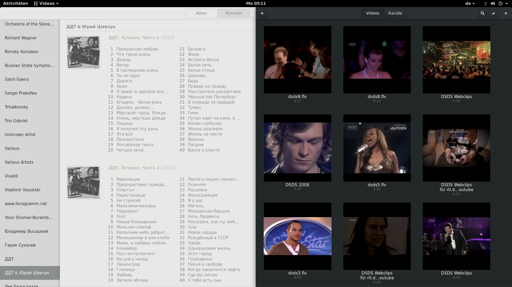
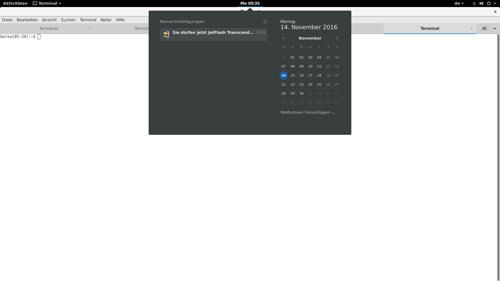
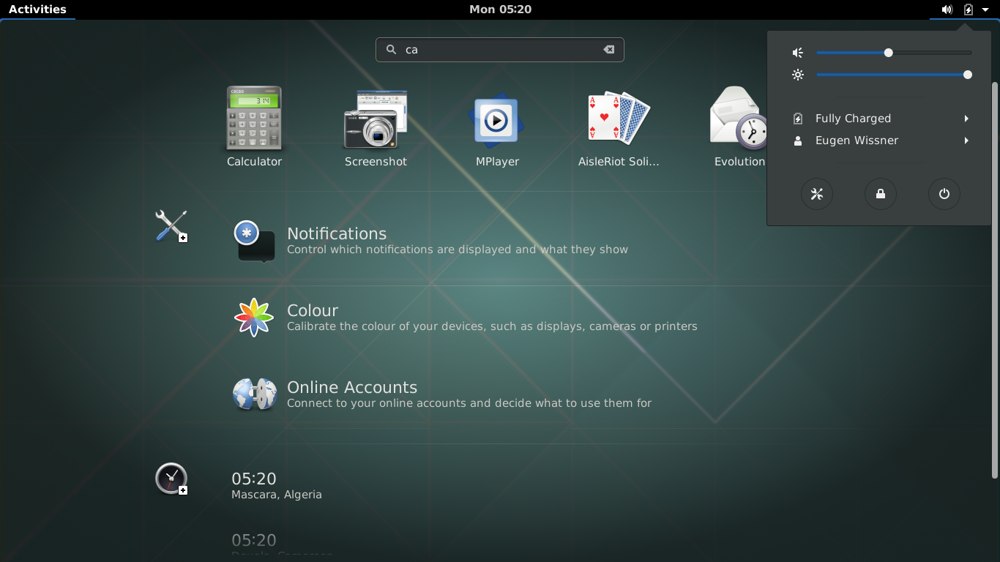
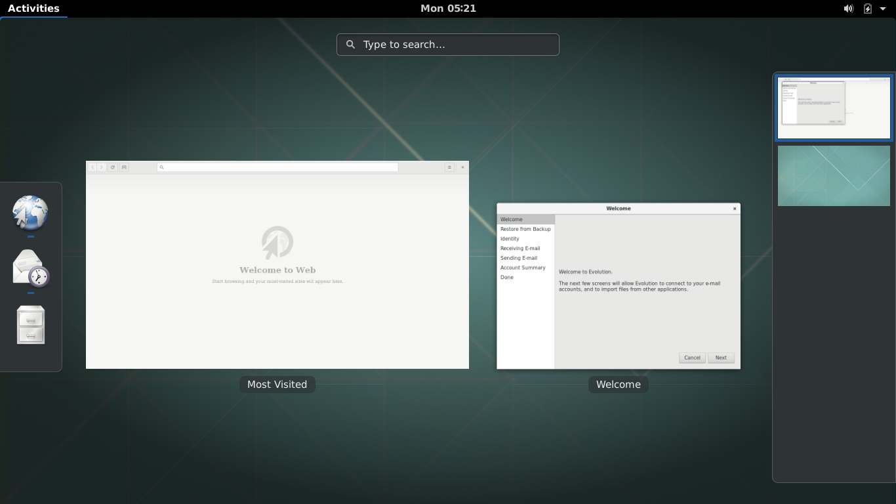
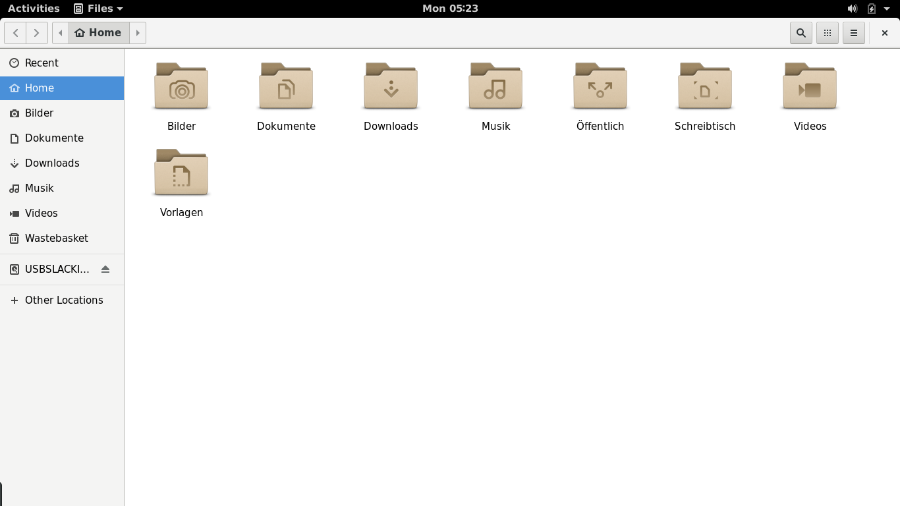

# Gnome 3 for Slackware Linux

## About

Dlackware provides SlackBuild scripts for Gnome 3. The SlackBuilds found here
can be used seperatly, but are ment to work as a set on top of PAM and
systemd.

It is a sources based project. We currently don't provide pre-built packages.
Since there are a lot of packages to build, we developed a small build
system which helps to build and install Gnome and its dependencies.

Our package set isn't the full Gnome distribution, but it isn't
minimalistic neither. If you miss some packages and you would like to
maintain them, fill free to create a pull request.

## Development

master branch is used for development for the latest Slackware stable.

### Current work

master is now updated for Gnome 3.22. And you can already get a working
desktop with them. But some work on the build system and some updates
are still needed.

There is `3.18/14.2` branch, but it is unstable, partly because of
Xwayland issues. So we hope make 3.22 to the first stable release. 

## Install

Full Slackware installation is required.

In the directory base/ you can find the file compile-order.
Build and install all the files on that list.

Alternative we have developed a build system that makes everything easier.
It reads the compile-order file and builds and installs everything on that list.

### Install the build system:
1. git clone https://github.com/Dlackware/dlackware
2. cd dlackware
3. ./dlackware.SlackBuild
4. upgradepkg --install-new /var/cache/dlackware/dlackware-\*-noarch-\*_dlack.txz

### Build Gnome:
1. git clone https://github.com/Dlackware/gnome
2. cd gnome
3. git submodule update --recursive --init
4. dlackware build

### Finished, what now?
- enable or disable services in /lib/systemd/system/ (dont forget gdm) (systemctl enable gdm.service)
- set graphical-target (init 4) as default (systemctl set-default graphical.target)
- or anything else you might forget
Reboot and have fun.
